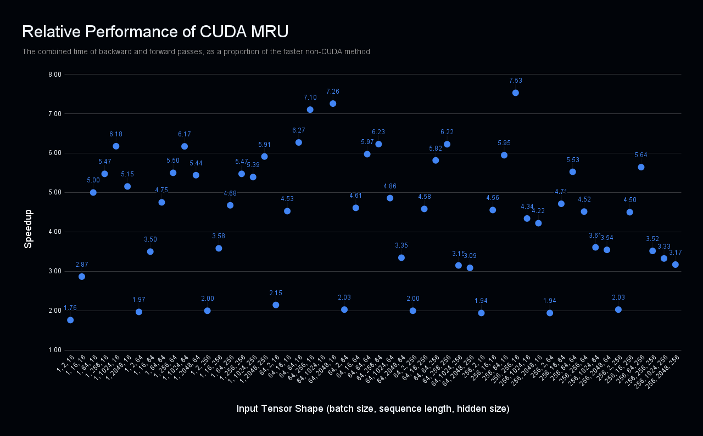

# cuda-mru
## Description
A PyTorch extension for the [MRU operator](https://github.com/mikayahlevi/mru-lm) implemented in CUDA. It uses the Sklansky scan to effeciently compute many of the matrix multiplications in parallel over multiple scans.
Currently, the code is still a work in progress so it has a few flaws.

## Drawbacks
The first is additional tensor shape restrictions:
 - The state order (the size of the last two dimensions of the input) must be divisible by TILE_WIDTH (defined as 4 in the code) in order to allow for multiple results for thread.
 - To fully leverage an optimization I wrote, the state order must be evenly divisible or a factor of 32.
 - The sequence length must be a power of two.
 - The size of the state matrices must be relatively small in order for the entire them to fit onto the GPUs shared memory.

Elaborating on the last bullet, I haven't yet implemented a way for the CUDA kernel to load the matrices into shared memory in chunks. As a result, the kernel will crash if it attempts to load too much data into shared memory.
Furthermore, I don't have a NVIDIA GPU, so the code probably lacks a lot of optimizations that could be revealed with profiling via a tool like NVIDIA Nsight Compute.

## Performance
Despite all of the drawbacks, the CUDA implementation still significantly outperforms both the Brent-Kung and Hillis-Steele scans implemented naively implemented in PyTorch.
Below is a graph shows the speedup over the naive code when running on an A100 GPU. Hidden size is the product of the size of the last two dimensions, giving the size of each matrix.

